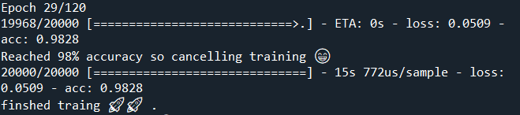
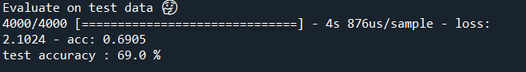

# Convolution NN for image classification

**Classes**
* Birds
* Cats
* Dogs
* Frogs

**Datasets**
* training set: 40,000 (32x32)images
* Testing set: 4,000  (32x32)images

**Reached 98% accuracy on training set**

**evaluating the model using test set**

**Technology**
* Tensorflow
* OpenCV
